**Impact of Weather Conditions on Air Quality**

# Overview

The aim of this analysis is to use SQL to determine the factors that have an influence on air pollution.
For this study, we worked on on the Beijing PM 2.5 public dataset from https://archive.ics.uci.edu/ml/datasets/Beijing+PM2.5+Data#

The data set contains hourly PM 2.5 data of US Embassy in Beijing from Jan 1st, 2010 to Dec 31st, 2014.

## Problem Definition

The air quality index in Beijing has increased over time. This may negatively impact not just the general populace but also the ecosystem as a whole and all species that live there.

## Solution

With the PM 2.5 pollutant as our primary emphasis, we will analyze and quantify the effect on the increase in the Air Quality Index. It has been discoverd that when levels of the air pollutant fine particulate matter (PM 2.5) are excessive, it poses a risk to people's health.
PM 2.5 are extremely small, inhalable particles that typically have a diameter of 2.5 micrometers or less and come from a variety of sources.

The data was cleaned and explored using SQL Server and the resulting clean SQL file linked and displayed in Power BI to generate a dashboard of the findings.
The SQL script can be found [here](/air_quality.sql)

## Answering Questions

The first five records excluding the first 24, where PM 2.5 values = 0 

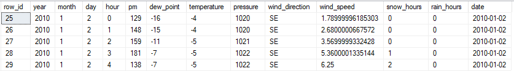

1. How are the average PM 2.5 levels distributed by wind direction ?

	SELECT wind_direction,
		AVG(pm) AS avg_pm
	FROM BeijingAir
	GROUP BY wind_direction
	ORDER BY avg_pm DESC;
	
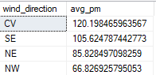

> On average, weather conditions are calm 

2. Air Quality Index Categories 

		WITH CTE AS(
				SELECT row_id, pm,
				CASE
					WHEN pm BETWEEN 0 AND 12 THEN 'Good'
					WHEN pm BETWEEN 12 AND 35 THEN 'Moderate'
					WHEN pm BETWEEN 35 AND 55 THEN 'Unhealthy for Sensitive Groups'
					WHEN pm BETWEEN 55 AND 150  THEN 'Unhealthy'
					WHEN pm BETWEEN 150 AND 250 THEN 'Very Unhealthy'
					ELSE 'Hazardous'
				END AS pm_levels
				FROM BeijingAir
				)
		SELECT TOP 5 row_id, pm, pm_levels
		FROM CTE
		WHERE pm > 0;
	
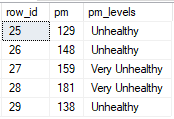

> The selected rows show that the PM 2.5 levels vary.

3. What is the average PM 2.5 levels by year ?
 
		SELECT year, 
		       AVG(pm) AS average_pm_levels
		 FROM BeijingAir
		 GROUP BY year 
		 ORDER BY average_pm_levels DESC;
	 
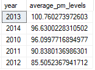

> 2013 had the highest average PM 2.5 levels and 2012 had the lowest.

3.1 Which wind direction had the most prevalent daily PM 2.5 levels in 2012?

		WITH daily_pm AS(
			SELECT
			wind_direction,  
			SUM(pm) AS daily_pm
			FROM BeijingAir
			WHERE year = 2012
			GROUP BY wind_direction
			)
			SELECT wind_direction, 
			MAX(daily_pm) max_daily_pm
			FROM daily_pm
			GROUP BY wind_direction
			ORDER BY max_daily_pm DESC;
			
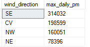

> For the year 2012, the common wind direction was SouthEast.

4. What are the average PM 2.5 levels by year and month limit 5?

		SELECT TOP 5
				year,
				month,
				AVG(pm) AS average_pm_levels
		 FROM BeijingAir
		 GROUP BY month,year
		 ORDER BY average_pm_levels DESC;
		 
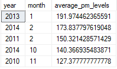

4.1 Bottom 5

		 SELECT TOP 5
				year,
				month,
				AVG(pm) AS average_pm_levels
		 FROM BeijingAir
		 GROUP BY month,year
		 ORDER BY average_pm_levels ASC;
		 
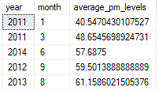

> In the month of January 2011 the average PM 2.5 level were at its lowest at 40.55 as opposed to January of 2013 with levels as high as 191.97

 5.On average, does the wind speed have any effect on the PM 2.5 level, limit to 10? 
 
		SELECT TOP 10 
				ROUND(wind_speed, 2) AS wind_speed, 
				AVG(pm) AS avg_pm
		FROM BeijingAir
		GROUP BY wind_speed 
		ORDER BY avg_pm DESC;
	
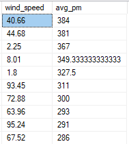
  
 > There is no correlation between average PM 2.5 and wind speed, because the values have no apparent trend with each other.
  
6. What is the most prevalent wind direction in Beijing ?

		SELECT 
			wind_direction,
			COUNT(wind_direction) AS wind
		FROM BeijingAir
		GROUP BY wind_direction
		ORDER BY wind DESC;
		
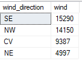

> The commonly occuring wind direction is SouthEast(SE), it comes as no suprise because Beijing is located 150 km SE of the Bohai sea.

7. What are the coldest months and what are their corresponding average PM 2.5 values, limit 5 ?

		SELECT TOP 5
				month,
				AVG(temperature) AS avg_temp, 
				AVG(pm) as avg_pm
		FROM BeijingAir
		GROUP BY month
		ORDER BY avg_temp ASC;

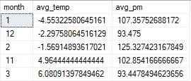

7.1 What are the hottest months and what are their corresponding average PM 2.5 values, limit 5 ?

		SELECT TOP 5
				month,
				AVG(temperature) AS avg_temp, 
				AVG(pm) as avg_pm
		FROM BeijingAir
		GROUP BY month
		ORDER BY avg_temp DESC;

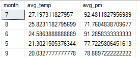

> On average January, December and February have the coldest temperatures, with February having the largest average PM 2.5 levels.

8. What are the maximum and minimum temperatures ?

		SELECT 
			MAX(temperature) AS max_temp,
			MIN(temperature) AS min_temp
		FROM BeijingAir;
		
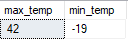

> Maximum tempature is 42 degrees and the lowest is -19.

9. What are the 5 lowest daily average PM 2.5 levels, limited to 16?

		SELECT TOP 16
			day,
			AVG(pm) AS avg_pm_levels
		FROM BeijingAir
		GROUP BY day
		ORDER BY avg_pm_levels ASC;
		
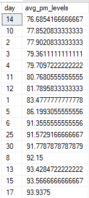

> Day 14 had the lowest average PM2.5 levels, and then the PM2.5 levels decreased and increased daily in no set order.

9.1 What are the 5 highest daily average PM 2.5 levels, limited to 16?

		SELECT TOP 16
			day,
			AVG(pm) AS avg_pm_levels
		FROM BeijingAir
		GROUP BY day
		ORDER BY avg_pm_levels DESC;
		
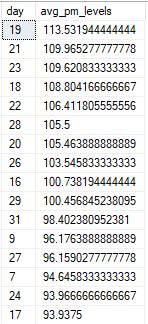

> Day 19 had the highest average PM 2.5 levels, then the levels decreased and increased gradually, in no particular order.

10. Which year had the least total PM 2.5 levels?
		SELECT 
			year,
			SUM(pm) AS total_pm
		FROM BeijingAir
		GROUP BY year
		ORDER BY total_pm ASC;
		
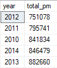

> 2012 had the lowest total PM2.5.

11. What are the total accumulated snow hours by year?

		SELECT 
			year,
			SUM(snow_hours) AS total_snow
		FROM BeijingAir
		GROUP BY year
		HAVING SUM(snow_hours) > 0
		ORDER BY total_snow DESC;

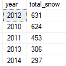

> In 2012 the total snow hours were high at 631.

11.1 What are the total accumulated rain hours by year ?

		SELECT 
			year,
			SUM(rain_hours) AS total_rain
		FROM BeijingAir
		GROUP BY year
		HAVING SUM(rain_hours) > 0
		ORDER BY total_rain DESC;
		
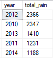

> For a total of 2366 hours it rained in 2012.

12. What are the maximum, minimum and average pm 2.5 levels ?

		SELECT MAX(pm) as max_pm, MIN(pm) AS min_pm, AVG(pm) AS avg_pm
		FROM BeijingAir
		WHERE pm > 0;
		
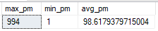

> On average, the PM 2.5 levels were 'Unhealthy' as they fall within the 55-150 micrograms per cubic meter range.
